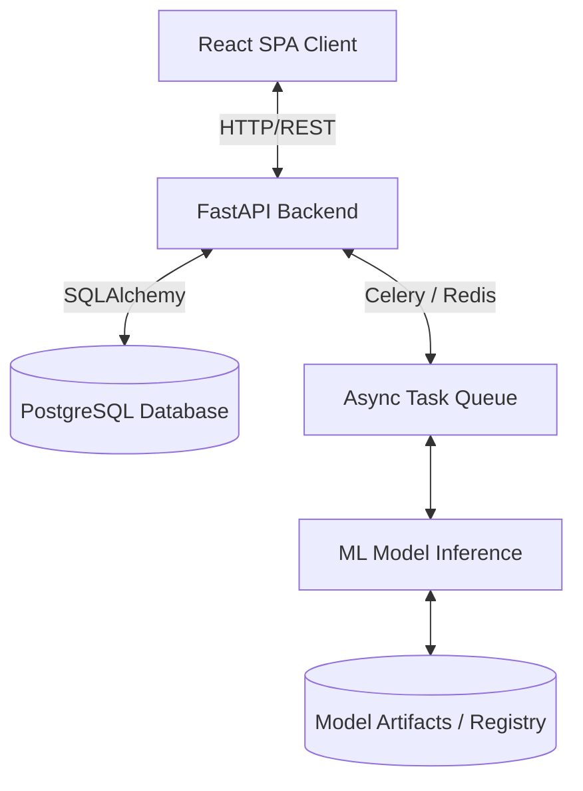

# Fake News Detection System - Architecture & Design Details

This document outlines the architecture, data flows, and configuration layers of the Fake News Detection System.

---

## 1. System Overview

The system consists of three main components:
1. **Frontend**: SPA built using React, TypeScript, and Vite. Communicates with the backend using REST APIs.
2. **Backend**: FastAPI app serving predictions, managing document uploads, storing report logs, and coordinating model runs.
3. **ML Infrastructure**: Offline/Online pipeline for processing raw training datasets, model tokenization, transformer training/evaluation (PyTorch/HuggingFace), and inference.

---

## 2. Component Design

### Backend Service (`/backend`)
- **FastAPI**: Main API framework chosen for high performance, automatic OpenAPI documentation, and asynchronous capabilities.
- **SQLAlchemy & Alembic**: Database ORM and migration setup.
- **Pydantic**: Data validation and schema specification.
- **Celery & Redis**: Background task workers for heavy text preprocessing and machine learning calculations.

### Frontend Service (`/frontend`)
- **React & Vite**: Extremely fast build times and hot reloading.
- **TypeScript**: Ensuring type safety across component properties and API payloads.
- **CSS Modules / Vanilla CSS**: Zero utility bloat, customized premium styles.

### Data & Model Operations (`/data`, `/model`)
- **Raw Data (`/data/raw`)**: Keeps copy-on-write initial data sets.
- **Processed Data (`/data/processed`)**: Model-ready train, validation, and test splits.
- **Model Registry (`/model/artifacts`)**: Directory storing serialized weights (e.g. PyTorch `.bin`/`.safetensors`), tokenizers (`tokenizer.json`), and model hyperparameter logs.

---

## 3. Directory Initialization
This project uses `.gitkeep` markers to preserve folder topology across git versions without tracking dynamic run-time outputs.
