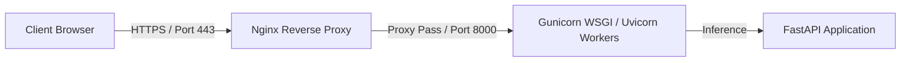

# Production Deployment Guide

This document covers deploying the Fake News Detection System to production servers.

---

## 1. Containerized Deployment with Docker Compose (Recommended)

Docker Compose offers the easiest, most reproducible path to running the complete stack (Backend API, React Frontend, Database, and Cache) in staging or production.

### Step 1.1: Clone & Configure Environments
Clone your repository to the production server and create the production `.env` file at the root:
```bash
cp .env.example .env
```
Ensure you update the configurations for production safety:
```ini
ENVIRONMENT=production
DEBUG=false
SECRET_KEY=generate-a-strong-random-key-here-for-security
BACKEND_CORS_ORIGINS=["https://fakenews.yourdomain.com"]
```

### Step 1.2: Launch Containers
Run the Docker Compose build and daemon process:
```bash
docker-compose -f docker-compose.yml up -d --build
```
This performs the following actions:
1. Builds the **FastAPI backend** container using the multi-stage build, exposing port `8000`.
2. Builds the **React/Vite frontend** container, compiling assets and serving them through **Nginx** on port `5173` (or redirected to `80`).
3. Launches **PostgreSQL** (`db`) and **Redis** (`redis`) containers, mounting persistent volumes to prevent data loss.

### Step 1.3: Verification
Check logs to verify startup:
```bash
docker-compose logs -f backend
```

---

## 2. Bare-Metal Linux Deployment (FastAPI + Nginx + Gunicorn)

If you prefer not to use Docker, follow this standard pattern to host on a Linux VPS (e.g., Ubuntu 22.04 LTS).



### Step 2.1: Host Backend with Systemd & Gunicorn
Create a Gunicorn systemd service file to keep the backend API running persistently.
Create `/etc/systemd/system/fakenews-backend.service`:
```ini
[Unit]
Description=Gunicorn instance to serve FastAPI Fake News API
After=network.target

[Service]
User=appuser
Group=www-data
WorkingDirectory=/var/www/fake-news-detection-system/backend
Environment="PATH=/var/www/fake-news-detection-system/backend/venv/bin"
EnvironmentFile=/var/www/fake-news-detection-system/backend/.env
ExecStart=/var/www/fake-news-detection-system/backend/venv/bin/gunicorn -w 4 -k uvicorn.workers.UvicornWorker app.main:app --bind 127.0.0.1:8000

[Install]
WantedBy=multi-user.target
```
Enable and start the service:
```bash
sudo systemctl daemon-reload
sudo systemctl start fakenews-backend
sudo systemctl enable fakenews-backend
```

### Step 2.2: Configure Nginx as Reverse Proxy
Configure Nginx to serve the compiled frontend static files and proxy API requests back to port `8000`.
Create `/etc/nginx/sites-available/fakenews`:
```nginx
server {
    listen 80;
    server_name fakenews.yourdomain.com;

    # Frontend compiled assets location
    root /var/www/fake-news-detection-system/frontend/dist;
    index index.html;

    location / {
        try_files $uri $uri/ /index.html;
    }

    # API Proxy configuration
    location /api/v1 {
        proxy_pass http://127.0.0.1:8000;
        proxy_set_header Host $host;
        proxy_set_header X-Real-IP $remote_addr;
        proxy_set_header X-Forwarded-For $proxy_add_x_forwarded_for;
        proxy_set_header X-Forwarded-Proto $scheme;
    }

    # Custom logs
    access_log /var/log/nginx/fakenews_access.log;
    error_log /var/log/nginx/fakenews_error.log;
}
```
Link site and restart:
```bash
sudo ln -s /etc/nginx/sites-available/fakenews /etc/nginx/sites-enabled/
sudo nginx -t
sudo systemctl restart nginx
```

### Step 2.3: Secure with SSL (Certbot)
Enforce HTTPS using Let's Encrypt certificates:
```bash
sudo apt install certbot python3-certbot-nginx
sudo certbot --nginx -d fakenews.yourdomain.com
```

---

## 3. CI/CD Pipeline (GitHub Actions Sample)

To automate deployments, set up a simple GitHub Actions workflow `.github/workflows/deploy.yml`:
```yaml
name: Production Continuous Deployment

on:
  push:
    branches: [ main ]

jobs:
  deploy:
    runs-on: ubuntu-latest
    steps:
      - name: Deploy via SSH
        uses: appleboy/ssh-action@master
        with:
          host: ${{ secrets.SSH_HOST }}
          username: ${{ secrets.SSH_USER }}
          key: ${{ secrets.SSH_PRIVATE_KEY }}
          script: |
            cd /var/www/fake-news-detection-system
            git pull origin main
            docker-compose down
            docker-compose up -d --build
```
This ensures your production machine pulls the latest code and safely rebuilds the docker layers whenever changes push to the main branch.
