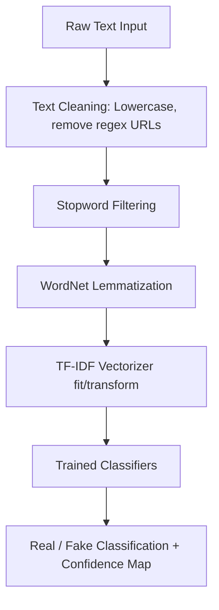

# VeritasAI - Project Implementation Report

This report documents the architectural methodologies, project directory allocations, development challenges, and future scope of the Fake News Detection System.

---

## 1. Directory Structure

```text
├── .env.example              # Blueprint environment configuration file
├── .gitignore                # Global git ignore configurations
├── docker-compose.yml        # Multi-container orchestration (FastAPI, React, Postgres, Redis)
├── README.md                 # Entry documentation page
├── requirements.txt          # Root Python dependencies meta-file
│
├── backend/                  # FastAPI Application Services
│   ├── app/                  # Application source package
│   │   ├── api/              # Route collection namespace
│   │   ├── core/             # Base configurations (database engines, config parsers)
│   │   ├── models/           # SQLAlchemy models
│   │   ├── schemas/          # Pydantic validation schemas
│   │   ├── services/         # Utility service logic (document parsing)
│   │   └── main.py           # FastAPI entrypoint file
│   ├── tests/                # Unit/Integration testing suite
│   ├── Dockerfile            # Secure container builder
│   ├── requirements.txt      # API package requirements
│   └── pyproject.toml        # Format and static checking rules (Ruff, Black, MyPy)
│
├── frontend/                 # Client Web Dashboard (Vite + Vanilla JS/HTML/CSS)
│   ├── index.html            # Main template containing layout anchors and CDNs
│   ├── style.css             # Glassmorphic themes and responsive declarations
│   ├── app.js                # Routing controls, fetch API connections, and charts
│   ├── package.json          # Node scripts configuration
│   └── vite.config.js        # Host mappings and backend API proxy rules
│
├── model/                    # Offline Pipeline & Machine Learning Modules
│   ├── artifacts/            # Model serialization storage folder (.pkl)
│   ├── dataset_loader.py     # Data stream parser and split coordinator
│   ├── preprocessing.py      # Cleaning pipeline (lowering, regex, lemmatization)
│   ├── feature_extraction.py # TF-IDF feature mapping module
│   ├── train.py              # Candidate model fitter and performance evaluator
│   ├── evaluate.py           # Verification script and metrics reporter
│   ├── predict.py            # API-facing inference class
│   └── __init__.py           # Package interfaces
│
├── data/                     # Local data caches (raw and processed data splits)
├── uploads/                  # Temporary file upload cache
├── reports/                  # Evaluation JSON logs and graph PNG plots
└── docs/                     # Documentation files
```

---

## 2. Technical Methodology

The core pipeline processes raw text into classification decisions using the following workflow:



### 2.1 Text Preprocessing
The `TextPreprocessor` cleans raw strings by:
1. Converting text to lowercase.
2. Removing HTML tags (`<[^>]+>`), URLs (`https?://\S+`), and emails.
3. Stripping punctuation and numbers.
4. Tokenizing the clean text, filtering out English stopwords, and lemmatizing the remaining tokens using NLTK's `WordNetLemmatizer`.

### 2.2 Feature Representation (TF-IDF)
The clean tokens are vectorized using **Term Frequency-Inverse Document Frequency (TF-IDF)** to extract unigram and bigram features:
$$\text{TF-IDF}(t, d, D) = \text{TF}(t, d) \times \text{IDF}(t, D)$$
The features are limited to a maximum of 5,000 components to prevent overfitting.

### 2.3 Model Selection & Comparison
`ModelTrainer` trains and compares four distinct classifiers:
1. **Logistic Regression**: Serves as a baseline model.
2. **Multinomial Naive Bayes**: Very fast text classifier that uses word probability counts.
3. **Linear SVM (`LinearSVC`)**: Identifies the optimal separating hyperplane, which performs well with high-dimensional sparse representations.
4. **Random Forest**: An ensemble method using decision trees to capture non-linear interactions.

---

## 3. Engineering Challenges

*   **Model Probabilities (SVM)**: `LinearSVC` does not natively support class probability computations (`predict_proba`). To display a confidence metric in the user interface, we implemented Platt scaling approximations using the decision function's signed distance passed through a sigmoid function:
    $$P(y=1|x) = \frac{1}{1 + e^{-f(x)}}$$
*   **Diverse Document Parsing**: Extracting clean text from unstructured PDF, Word, and text documents can yield inconsistent parsing. We built specialized helper methods in `DocumentParser` using `pypdf` and `docx` to handle text extraction and fallback encodings.
*   **Async Operations**: Model retraining blocks the main FastAPI execution thread. We resolved this by using FastAPI's native `BackgroundTasks` to train the models in the background without blocking API endpoints.

---

## 4. Future Scope

*   **Transformer Architecture**: Incorporate deep learning models (such as BERT or RoBERTa) to better capture contextual semantics, sarcasm, and sentence structures.
*   **Active Learning loop**: Allow moderators to flag incorrect predictions in the UI and write them to a database table to continuously update the model.
*   **Fact-Checking Scrapers**: Connect the classification pipeline to external search engine APIs to cross-verify claims in real-time.
